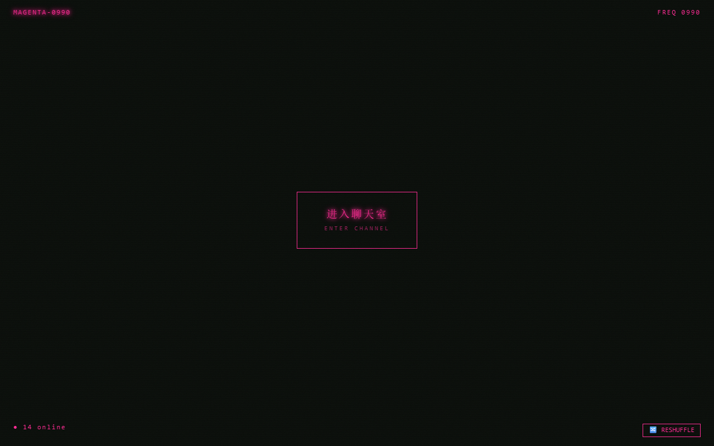

# kuoluosaigai

> 谐音"阔落塞该"。一个终端风的概念首页 + 真匿名聊天室，致敬无头骑士异闻录里的 Dollars 频道。



打开站点，像在接入一个匿名频道：开机序列逐行打印日志、光标闪烁，按回车或点击屏幕，一道扫描线自上而下扫过，露出黑底扫描线的主界面。随机分到一个频道（绿/青/品红/琥珀），代号 + 频率显示在顶栏。点中央脉动的「进入聊天室」，服务端即时给你分配一个 `ANON-XXXX` 匿名代号，进入全屏终端聊天——消息即焚、无需登录、在线人数实时可见。

## 特性

- **开机序列 + 接入动画**：打字机式终端日志 + 闪烁光标；Enter 键 / 点击任意处触发，自上而下扫描线 wipe 露出主界面（三态相位 `boot → wiping → shell`，reduced-motion 直达终态）
- **4 个随机频道**：SETSUBUN(绿) / NEBULA(青) / MAGENTA(品红) / AMBER(琥珀)，sessionStorage 持久，刷新不跳变；状态栏 🔄 RESHUFFLE 一键换频，主色经 CSS 变量 + Ant Design ConfigProvider 全局注入
- **真匿名聊天室**：Node + WebSocket 自托管后端，随机昵称（不可自选）、单全局房间、频道徽章、纯文本 + 限速(10/min) + 长度截断(280)、真实在线计数、断线退避重连
- **终端风 favicon**：绿框 `K` + 扫描线 SVG 矢量图标
- **降级**：尊重 `prefers-reduced-motion`，关动效直接显示终态；WS 端点未配置时聊天室显示离线文案不崩

## 技术栈

| 层 | 技术 |
|---|---|
| 前端 | Vue 3 + Ant Design Vue（魔改主题）+ Vitest。自定义创意做英雄区，Ant Design 做结构化面板 |
| 后端 | Node.js + [`ws`](https://www.npmjs.com/package/ws)，无框架、无数据库、无持久化（状态全在进程内存） |
| 传输 | WebSocket，JSON 文本帧 |

前端纯静态可托管到任意静态站；后端是独立常驻 Node 进程。详见 [`docs/chatroom-architecture.md`](docs/chatroom-architecture.md)。

## 本地开发

```bash
# 前端
npm install
npm run serve          # http://localhost:8080（被占用会自增端口）

# 后端聊天服务（另开终端）
cd server && npm install && npm start    # 默认 ws://localhost:8080

# 让前端连到后端：项目根新建 .env.local
echo "VUE_APP_WS_URL=ws://localhost:8080" > .env.local
```

打开两个浏览器窗口访问前端，各自经开机序列 → 进入聊天室，即可看到对方加入 / 发言 / 在线数变化。

```bash
npm test               # 前端单测（vitest / jsdom，35 个）
cd server && npm test  # 后端单测（vitest / node，4 个）
npm run build          # 生产构建，产物在 dist/
```

## 项目结构

```
server/
  index.js                # Node+ws 聊天服务：昵称/广播/限速/截断/在线计数
  start.js                # 入口，读 PORT 启动
src/
  theme/channels.js       # 4 频道定义 + 抽签/重抽/代号
  composables/
    useTypewriter.js      # 打字机序列
    useChat.js            # WebSocket 传输 + 状态（连接/昵称/消息/在线数/重连）
  components/
    BootSequence.vue      # 开机序列 + Enter/点击触发
    ScanlineWipe.vue      # 接入扫描线覆盖层
    ChannelShell.vue      # 主界面外壳（代号/状态栏/RESHUFFLE）
    CenterGate.vue        # 聊天室入口
    ChatRoom.vue          # 全屏终端聊天 UI
  styles/terminal.css     # 扫描线/噪点/辉光/降级
  App.vue                 # 装配：抽频道/主题注入/相位切换/聊天室接入
public/
  favicon.svg             # 终端风 K 字徽
```

设计文档见 `docs/superpowers/specs/`，实现计划见 `docs/superpowers/plans/`。

## 路线图

- [x] v1：概念首页 + 聊天室入口（纯静态）
- [x] v1.1：接入动画补全（Enter 键 + 扫描线 wipe）
- [x] v2：WebSocket 真匿名聊天室（随机昵称、单全局房间、频道徽章）
- [ ] 后续：多房间、消息持久化/历史、后端水平扩展（Redis pub/sub）、部署上线
